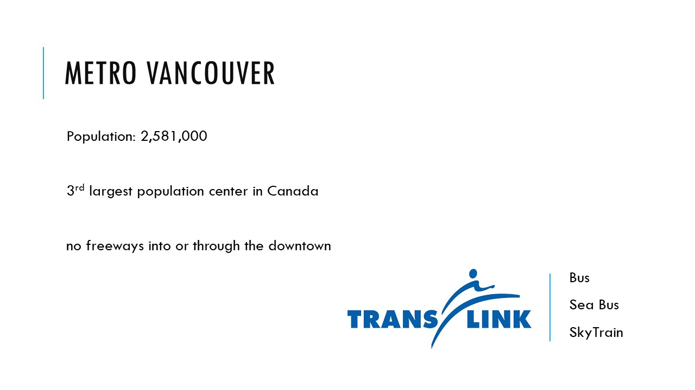
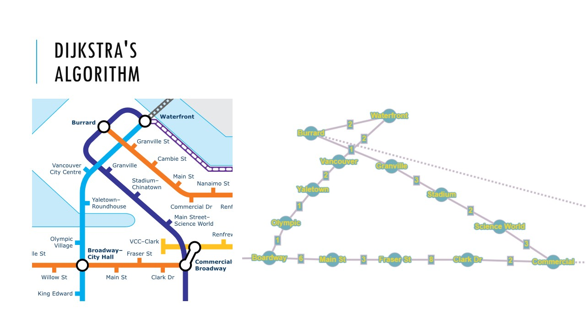
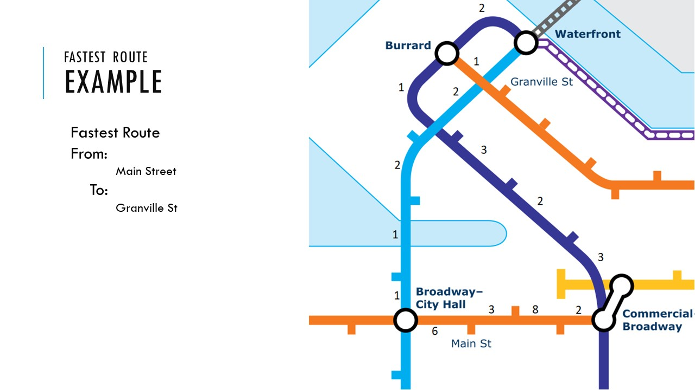
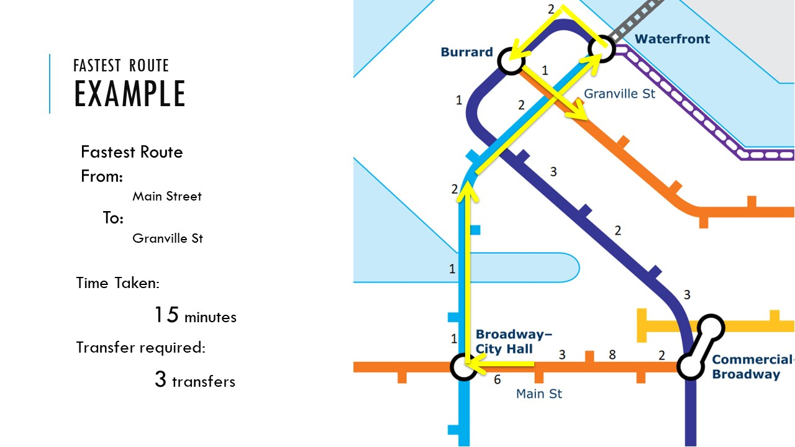
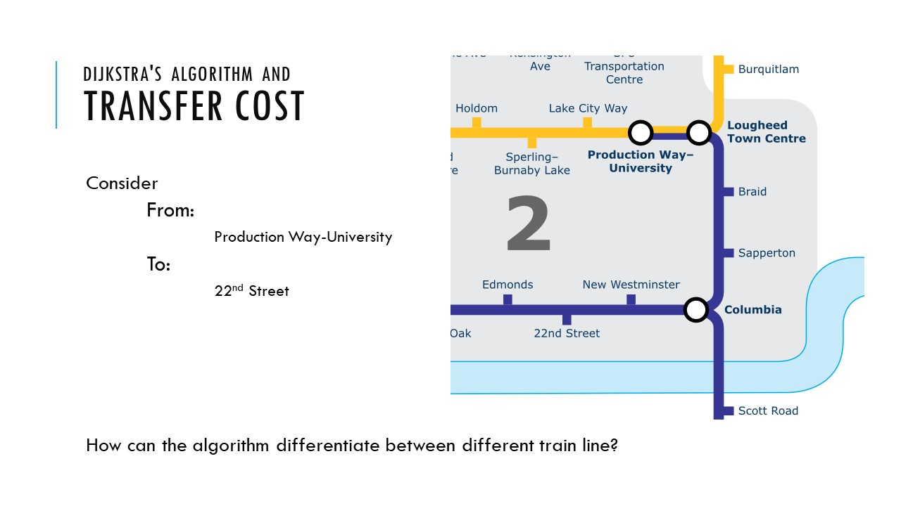
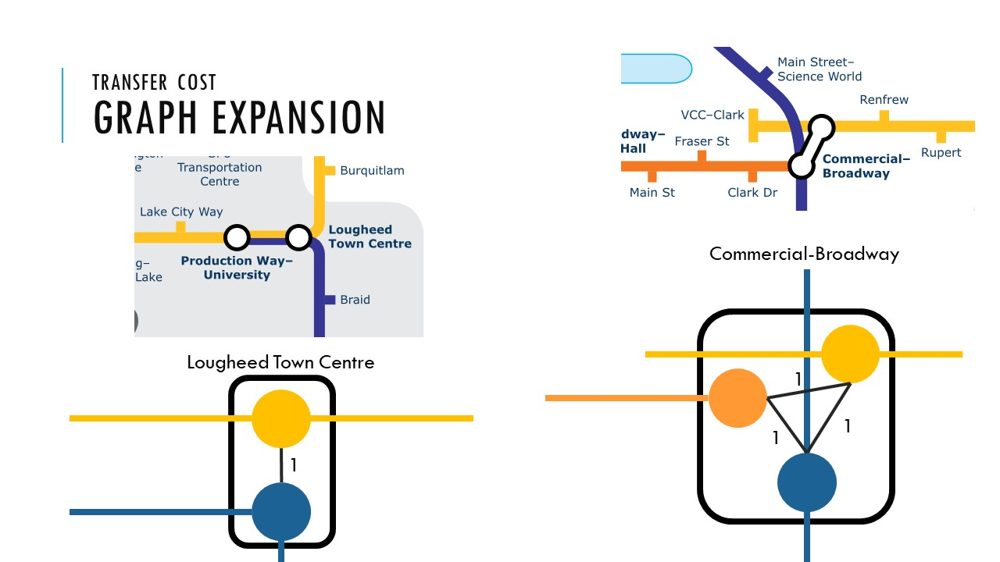
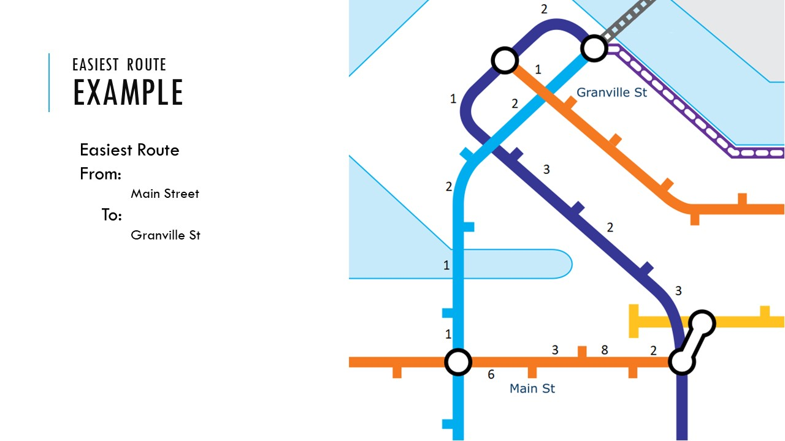
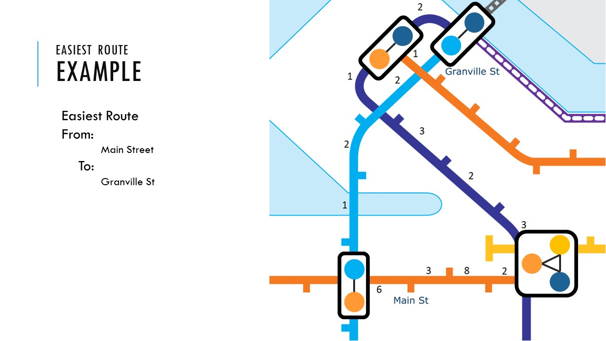
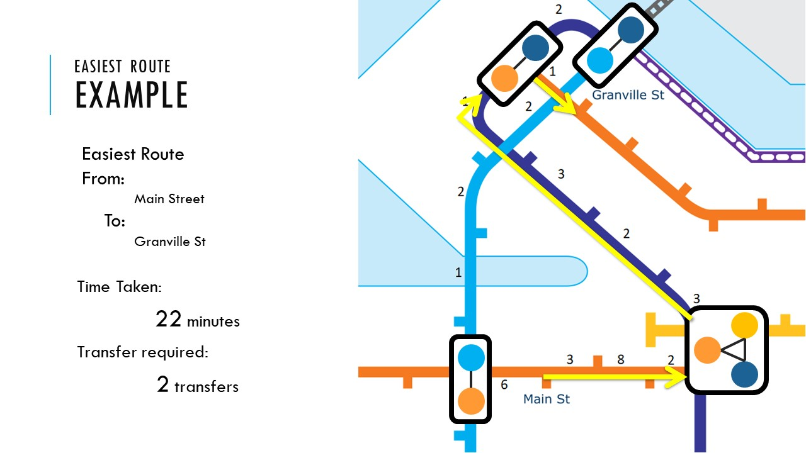
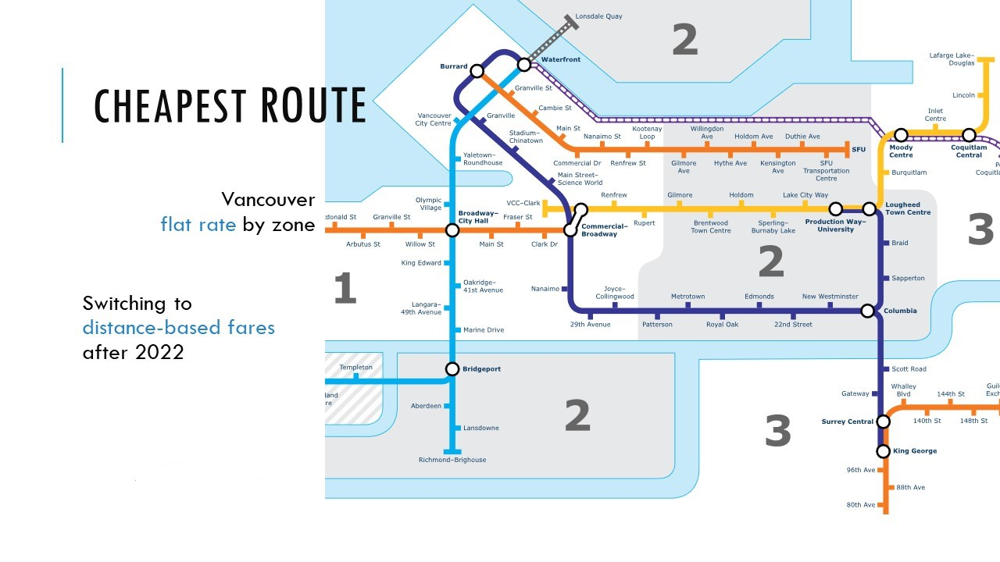

# Fastest, Cheapest, and Easiest Pathfinder

Command Line Application to find the fastest, cheapest and easiest path in Vancouver's public transport system using Java employing Dijkstra Algorithm.

